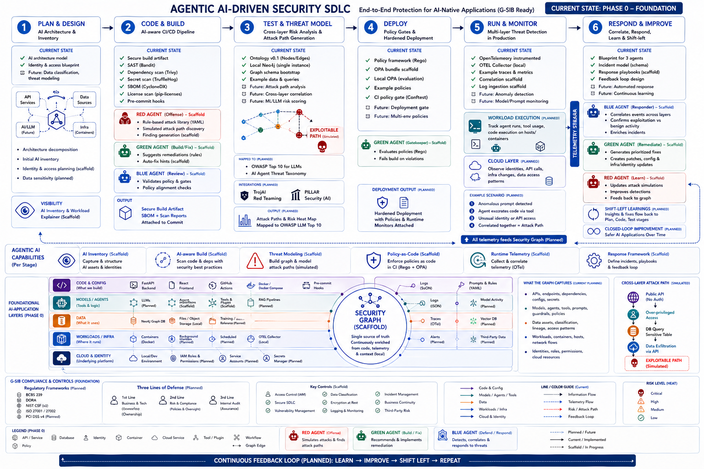
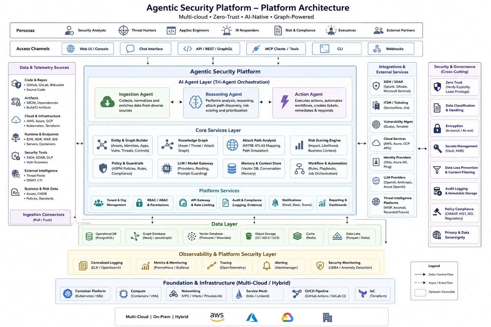
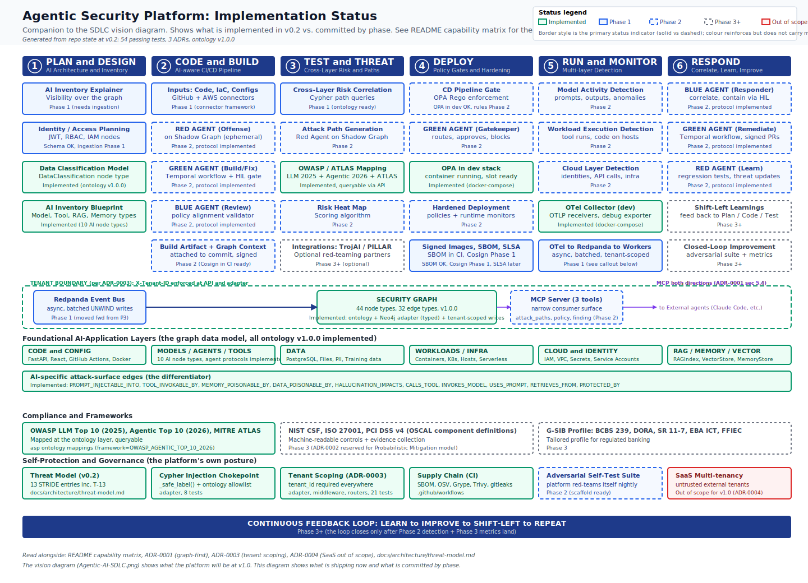
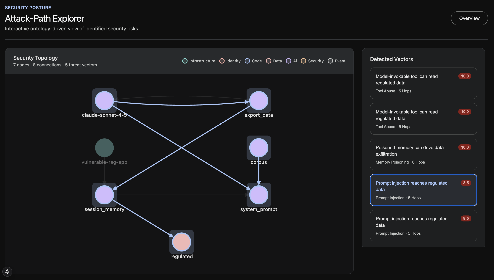

# Agentic Security Platform

> **Status: v0.1 — foundation plus live graph demo, with Option C MVP in flight for the launch.** Tenant scoping is enforced, the Cypher injection chokepoint is in place, the GitHub connector is now multi-stack (Python static today; Java + Node manifest pass landed in week 1), and the seeded demo graph powers live attack-path queries and a frontend graph explorer. The canonical prompt-injection path traverses an explicit `Prompt` node (`Source -> PROMPT_INJECTABLE_INTO -> Prompt <- USES_PROMPT - Model`) before reaching tool and data sinks. The launch was postponed 4–6 weeks from 2026-04-26 to ship an LLM-assisted source extractor for Java/Node ([ADR-0005](docs/adr/0005-llm-scanner-grounding-contract.md)) — grounded, verified, and reproducibly cached. The remaining Phase 1 ingestion work stays marked as planned until it has both passing tests and a working demo.

## Agentic-AI-Security-SDLC


## Agentic-AI-SDLC-Platform


## Implementation status


**An open-source, graph-native security platform for AI-native applications. Maps to OWASP LLM Top 10 (2025) and OWASP Agentic Top 10 (2026). Apache 2.0.**

A graph-native, telemetry-driven, agentic security platform for AI-native applications. Open source under the [Apache 2.0 license](LICENSE).

## Why this exists

Conventional security tools answer questions like "is this code vulnerable?" or "is this configuration risky?" An agentic AI application generates a different question: *given an untrusted input that can reach a model, a tool that model can invoke, an over-privileged identity that tool runs as, and a sensitive data store that identity can read — is there a path through all of that?*

That question is a graph traversal. It is the question this platform exists to answer.

The platform extends the security-graph approach (familiar from BloodHound and CSPM tooling) with first-class AI-application elements: models, prompts, guardrails, tools, RAG indexes, vector stores, agent memory. It maps the resulting risks to the [OWASP Top 10 for LLM Applications 2025](https://genai.owasp.org/resource/owasp-top-10-for-llm-applications-2025/), the [OWASP Top 10 for Agentic Applications 2026](https://genai.owasp.org/resource/owasp-top-10-for-agentic-applications-for-2026/), and [MITRE ATLAS](https://atlas.mitre.org/). And it operates on a tri-agent model — Red (offense), Blue (defense), Green (remediation) — with each agent's runtime decisions logged to the graph as evidence.

## Positioning

For graph-based security analysis, **BloodHound is the conceptual peer**: relationships are the security primitive, not isolated findings. For continuous, multi-environment ingestion, **CloudQuery is the operational peer**: a single pipeline routes data from many sources into isolated destinations, with tenant scoping a property of the pipeline rather than an afterthought. The platform inherits from both. It is *not* trying to be Wiz — Wiz is a billion-dollar commercial product with a custom graph engine; this is the Apache-2.0 reference implementation that regulated-industry teams can adopt and that AI-SPM vendors can benchmark against.

## Capability matrix

> 📊 **See also**: [`docs/architecture/implementation-status.svg`](docs/architecture/implementation-status.svg) is the visual companion to this matrix — a one-page diagram showing which components of the SDLC vision are implemented today and which are committed to which phase. The vision diagram (`Agentic-AI-SDLC.png`) shows what the platform will be at v1.0; the implementation-status diagram shows what is shipping now.

| Capability | v0.1 (now) | Phase 1 | Phase 2 | Phase 3 | Phase 4 (v1.0) |
|---|:-:|:-:|:-:|:-:|:-:|
| **Graph & ontology** | | | | | |
| Versioned graph ontology (44 nodes, 32 edges) | ✅ | | | | |
| Mappings to OWASP LLM Top 10 / Agentic Top 10 / MITRE ATLAS | ✅ | | | | |
| AI-specific edges (`PROMPT_INJECTABLE_INTO`, `TOOL_INVOKABLE_BY`, ...) | ✅ | | | | |
| Neo4j adapter (typed `upsert_node` / `upsert_edge`) | ✅ | | | | |
| Cypher attack-path query library (`find_prompt_injection_paths`, `find_tool_abuse_paths`, `find_memory_poisoning_paths`) | ✅ | | | | |
| Graph schema migrations | | 🔨 | | | |
| **Tenancy** (per [ADR-0003](docs/adr/0003-tenant-scoping-discipline.md), [ADR-0004](docs/adr/0004-saas-multi-tenancy-out-of-scope.md)) | | | | | |
| Tenant scoping discipline (`tenant_id` on every node and edge) | ✅ | | | | |
| Tenant-bound adapter sessions (no method without explicit `tenant_id`) | ✅ | | | | |
| API tenant binding via `X-Tenant-ID` header + middleware | ✅ | | | | |
| API tenant binding via JWT claim | | | 🔨 | | |
| Logical isolation: dev/staging/prod, multi-client consultancy | ✅ | | | | |
| SaaS multi-tenancy (mutually-untrusted external customers) | ❌ | ❌ | ❌ | ❌ | ❌ |
| **API & CLI** | | | | | |
| FastAPI service (`/health`, `/api/ontology`, live `/api/security/attack-paths`) | ✅ | | | | |
| `asp` CLI (`ontology show`, `validate`, `summary`, `mappings`) | ✅ | | | | |
| `asp scan <repo>` | | 🔨 | | | |
| `asp policy test` | | | 🔨 | | |
| `asp compliance evidence` | | | | 🔨 | |
| **Ingestion** | | | | | |
| OTel collector wired up (dev) | ✅ | | | | |
| Redpanda-based event bus (per Round-2 review: moved from Phase 3) | | 🔨 | | | |
| OTel → Redpanda → async graph workers (batched `UNWIND`) | | 🔨 | | | |
| Trace correlation (TraceSpan ↔ graph nodes) | | 🔨 | | | |
| **Connectors** | | | | | |
| Connector interface defined | | 🔨 | | | |
| GitHub connector — Python static scanner | ✅ | | | | |
| GitHub connector — multi-stack dispatcher (Python / Java / Node) | ✅ | | | | |
| GitHub connector — Java/Gradle manifest parsers + SDK→Model inference | ✅ | | | | |
| GitHub connector — Node `package.json` manifest parser + SDK→Model inference | ✅ | | | | |
| LLM-assisted source extractor with grounding + verification ([ADR-0005](docs/adr/0005-llm-scanner-grounding-contract.md)) | | 🔨 | | | |
| Profile-driven seed (`targets/<x>.yaml`) with `expected_nodes` pre-flight | ✅ | | | | |
| AWS connector (Bedrock / IAM / S3) | | 🔨 | | | |
| Azure / GCP connectors | | | 🔨 | | |
| Artifactory / Xray | | | 🔨 | | |
| ServiceNow AVR | | | 🔨 | | |
| **Agents** | | | | | |
| Agent protocols (`RedAgent` / `BlueAgent` / `GreenAgent` ABCs) | ✅ | | | | |
| All agents run as Temporal workflows (durable, resumable) | | | 🔨 | | |
| Red Agent on a Shadow Graph (ephemeral fork, no writes to system of record) | | | 🔨 | | |
| Blue Agent containment actions require human-in-the-loop approval | | | 🔨 | | |
| Green Agent remediation PRs with human approval gate | | | 🔨 | | |
| MCP server — three tools (`query_attack_paths`, `evaluate_policy`, `explain_finding`) | | | 🔨 | | |
| MCP client (we consume external tools) | | | 🔨 | | |
| **Policy** | | | | | |
| OPA in dev stack | ✅ | | | | |
| Rego policy bundle (LLM/Agentic Top 10 rules) | | | 🔨 | | |
| Bundles distributed as signed OCI artifacts | | | | 🔨 | |
| **Compliance** | | | | | |
| OSCAL component definitions (NIST CSF, ISO 27001, PCI DSS v4) | | | | 🔨 | |
| Probabilistic Mitigation model in compliance mapping ([ADR-0002](docs/adr/) reserved) | | | | 🔨 | |
| G-SIB profile (BCBS 239, DORA) | | | | 🔨 | |
| VEX generation from graph reachability | | | | 🔨 | |
| **Self-test** | | | | | |
| Unit tests across asp-core, asp-adapters, asp-api, asp-cli, connectors, scripts | ✅ | | | | |
| Cypher injection chokepoint (`_safe_label` + ontology allowlist + strict regex) | ✅ | | | | |
| Vulnerable RAG demo app + seeded OWASP-mapped adversarial scenario | ✅ | | | | |
| Adversarial self-red-team suite | | | 🔨 | | |
| 100% OWASP LLM + Agentic Top 10 adversarial coverage | | | | | 🎯 |
| **Supply chain** | | | | | |
| Apache 2.0 license | ✅ | | | | |
| CI: ruff + mypy + pytest + OPA test + frontend typecheck | ✅ | | | | |
| CycloneDX SBOM generation | ✅ | | | | |
| OSV-Scanner + Grype + Trivy + gitleaks | ✅ | | | | |
| Cosign-signed container images (keyless via OIDC, `.github/workflows/build.yml`) | ✅ | | | | |
| SLSA Level 3 build provenance (via `actions/attest-build-provenance`) | ✅ | | | | |
| **Frontend** | | | | | |
| Next.js overview dashboard with live attack-path summary | ✅ | | | | |
| Cytoscape graph viewer (category colors + highlighted path) | ✅ | | | | |
| Attack-path browser (sidebar findings + OWASP mappings) | ✅ | | | | |
| Incidents dashboard | | | 🔨 | | |
| **Governance** | | | | | |
| ADR-0001 (graph-first architecture) | ✅ | | | | |
| ADR-0003 (tenant scoping discipline) | ✅ | | | | |
| ADR-0004 (SaaS multi-tenancy out of scope) | ✅ | | | | |
| ADR-0005 (LLM scanner grounding contract) | ✅ | | | | |
| Threat model (13 STRIDE entries including T-13 cross-tenant poisoning) | ✅ | | | | |
| GOVERNANCE / SECURITY / CONTRIBUTING | ✅ | | | | |
| Independent third-party threat-model review | | | | | 🎯 |

Legend: ✅ done · 🔨 planned for that phase · 🎯 release blocker for v1.0 · ❌ explicitly out of scope · blank = not yet scoped

## Quickstart

Requires Docker (or Podman), Docker Compose (or `podman-compose`), Python 3.12+, and [`uv`](https://docs.astral.sh/uv/).

```bash
git clone https://github.com/<org>/agentic-security-platform.git
cd agentic-security-platform
cp .env.example .env

# Bring up the dev stack: Neo4j, OTel collector, OPA, asp-api, frontend.
docker compose up --build -d
```

## Try It In 5 Minutes

```bash
git clone https://github.com/<org>/agentic-security-platform.git
cd agentic-security-platform
cp .env.example .env
docker compose up --build -d

python3 -m connectors.github.src \
    --repo-path ./examples/vulnerable-rag-app \
    --neo4j-uri bolt://localhost:7687 \
    --neo4j-user neo4j \
    --neo4j-password changeme

python3 scripts/seed_graph.py \
    --target targets/vulnerable-rag-app.yaml \
    --neo4j-uri bolt://localhost:7687 \
    --neo4j-user neo4j \
    --neo4j-password changeme
```

Then:

1. Open <http://localhost:3000>
2. Click **View graph**
3. Inspect the seeded attack paths mapped to OWASP Agentic Top 10 in <http://localhost:3000/graph>

To point the demo at a different GitHub repo (any of Python, Java, or Node), see the [demo recording guide](docs/demo-recording-guide.md) — it walks through cloning, dry-scanning to discover node IDs, authoring `targets/<your>.yaml`, and running the live scan + seed against the new profile.

### Using Podman (macOS / Linux)

If you are using **Podman** instead of Docker Desktop (e.g., on a MacBook Pro), the repository is fully compatible:

```bash
# Install podman and podman-compose (macOS)
brew install podman podman-compose

# Initialize and start the podman machine
podman machine init
podman machine start

# Bring up the dev stack
podman-compose up --build -d
```

Then:

- API: <http://localhost:8000> — try `/health`, `/api/ontology`, `/api/ontology/nodes`
- API docs (OpenAPI / Swagger): <http://localhost:8000/docs>
- Frontend overview: <http://localhost:3000>
- Frontend graph explorer: <http://localhost:3000/graph>
- Neo4j browser: <http://localhost:7474> (user `neo4j`, password from `.env`)

For Python-only development without Docker:

```bash
uv sync --all-packages --dev
uv run pytest                     # workspace test suite
uv run asp ontology validate      # CLI sanity check
uv run asp ontology summary       # Pretty table of nodes/edges by category
uv run asp-api                    # Start the API on :8000
```

### Seed the demo graph

To light up the live attack-path API and the `/graph` frontend view, scan and seed the intentionally vulnerable demo app into Neo4j:

```bash
python3 -m connectors.github.src \
    --repo-path ./examples/vulnerable-rag-app \
    --neo4j-uri bolt://localhost:7687 \
    --neo4j-user neo4j \
    --neo4j-password changeme

python3 scripts/seed_graph.py \
    --target targets/vulnerable-rag-app.yaml \
    --neo4j-uri bolt://localhost:7687 \
    --neo4j-user neo4j \
    --neo4j-password changeme
```

The seed verifies every `expected_nodes` ID in the profile exists in Neo4j before writing any edges, so it aborts with a clear "did you run the connector?" error if the connector and profile are out of sync rather than silently no-opping.

The seed step materializes the full demo traversal, including:
- a concrete `Prompt` node for the system prompt surface
- `Model -[:USES_PROMPT]-> Prompt`
- `RAGIndex/MemoryStore -[:PROMPT_INJECTABLE_INTO]-> Prompt`
- `Tool -[:READS]-> MemoryStore -[:CLASSIFIED_AS]-> DataClassification(level="regulated")`

Then open:

- API attack paths: <http://localhost:8000/api/security/attack-paths>
- Frontend graph explorer: <http://localhost:3000/graph>

### Demo screenshot



## Repository layout

```
packages/
├── asp-core/         Pure domain — graph ontology, agent protocols, no I/O
├── asp-adapters/     Infra drivers — Neo4j, OTel, LiteLLM, OPA, MCP
├── asp-agents/       LangGraph + Temporal agent implementations (Phase 2)
├── asp-api/          FastAPI service
└── asp-cli/          `asp` CLI

connectors/
└── github/           Multi-stack repo scanner
    └── src/
        ├── stacks/   python/, java/, node/ — per-stack manifest + scanner
        └── llm/      ADR-0005 LLM scanner (schema, adapters, cache, verifier)

frontend/             Next.js 15 + React 19 overview dashboard + graph UI
scripts/seed_graph.py Profile-driven seed for security-semantic edges
targets/              One YAML per demo target (vulnerable-rag-app, J1, N1)
prompts/              Apache-2.0 prompts for the LLM scanner (cache-keyed)
policies/             Rego policy bundle (Phase 2+)
compliance/           OSCAL component definitions (Phase 3+)
deploy/               Helm charts, Terraform, k8s manifests
docs/                 MkDocs site, ADRs, threat model, demo recording guide
.github/workflows/    CI: ci, sbom, security-scan, build, adversarial, release, docs
```

The packaging discipline is hexagonal: `asp-core` has zero I/O dependencies; only `asp-adapters` is allowed to import database / network / LLM clients. See [ADR 0001](docs/adr/0001-graph-first-architecture.md) for why.

## Concepts in 60 seconds

**Security Graph.** A Neo4j graph whose schema (the *ontology*) is a versioned, machine-readable artifact. Nodes include the usual suspects (cloud accounts, IAM roles, repos, images, CVEs) plus AI-application elements (models, prompts, tools, RAG indexes, agent memory). Edges include structural and identity relationships *and* AI-specific attack-potential edges like `PROMPT_INJECTABLE_INTO`, `USES_PROMPT`, `TOOL_INVOKABLE_BY`, `MEMORY_POISONABLE_BY`. Run `uv run asp ontology summary` to see the full catalog.

**Tri-agent model.** Three agents, narrow scopes, strict isolation:
- **Red** proposes attack paths against the graph. No customer-write credentials. Never holds Green's keys.
- **Blue** correlates runtime telemetry (OTel spans) back to graph nodes. Detects exploitation in progress.
- **Green** generates remediations. Writes go through a Temporal workflow with human approval. Every PR is signed.

**Policy as code.** Single Rego bundle distributed as a signed OCI artifact. The same bundle gates pre-commit, PRs, deployments, and runtime — one source of truth.

**Compliance as code.** OSCAL component definitions, with evidence collection wired directly to graph queries. Replaces hand-maintained spreadsheets.

**MCP, both ways.** The platform consumes external tools via MCP and exposes its own MCP server so other teams' agents can query the Security Graph.

For deeper reading, start with [ADR 0001](docs/adr/0001-graph-first-architecture.md) (the graph-first commitment), [ADR 0005](docs/adr/0005-llm-scanner-grounding-contract.md) (the LLM-scanner grounding contract that bounds the launch's Option C MVP), and the [threat model](docs/architecture/threat-model.md). The [demo recording guide](docs/demo-recording-guide.md) walks through the full live-demo workflow including how to onboard any GitHub repo as the target.

## For sponsors

For executive review and amplification planning, see the unpublished launch draft: [docs/launch-post-draft.md](docs/launch-post-draft.md). It frames the project in sponsor-facing terms, covers the graph-first thesis, and points to the ADR process as evidence for how architectural decisions get made here.

## Roadmap

Phases are roughly quarterly. The [proposal](docs/) has the long version.

- **Phase 0 — Foundation (now)**: This README. Scaffold, ontology, governance, CI. Tenant scoping discipline ([ADR-0003](docs/adr/0003-tenant-scoping-discipline.md)) and Cypher injection chokepoint enforced from the first commit.
- **Phase 1 — Graph + ingestion MVP**: GitHub connector, attack-path query library, seeded end-to-end adversarial demo, and frontend graph view are now live. The demo graph includes explicit prompt surfaces and OWASP-mapped attack paths through regulated data. The connector is multi-stack since v0.2 — Python, Java (pom + Gradle), and Node (package.json) all dispatch through one entry point, and the seed is now profile-driven (one `targets/<x>.yaml` per demo target). The launch is gated on the LLM-assisted source extractor for Java/Node ([ADR-0005](docs/adr/0005-llm-scanner-grounding-contract.md)) — schema, adapters (Anthropic + OpenAI), cache, and verifier landed in week 2; orchestrator and production prompts in flight. Remaining Phase 1 work: AWS connector, **Redpanda event bus + async graph workers** (moved forward from Phase 3 per architectural review), and OTel→graph ingestor.
- **Phase 2 — Agents + policy**: All agents on Temporal (durable, resumable). Red Agent on a Shadow Graph. Blue containment actions through human-approval gates. Green Temporal workflow with human approval on writes. Rego policies as OCI bundles. Three-tool MCP server. First external design partner.
- **Phase 3 — Compliance + scale**: OSCAL component definitions, Probabilistic Mitigation model ([ADR-0002](docs/adr/) reserved), VEX generation, horizontal agent scale-out. 75% Agentic Top 10 adversarial coverage.
- **Phase 4 — v1.0**: JWT-based tenant binding, OIDC/SSO, 5+ community connectors, three-cloud reference deployment, third-party threat-model review. **100% OWASP LLM + Agentic Top 10 adversarial coverage** is a release blocker. SaaS multi-tenancy remains out of scope per [ADR-0004](docs/adr/0004-saas-multi-tenancy-out-of-scope.md).

## Contributing

We need help. Connectors, policies, compliance mappings, and frontend work are all open. Start with [CONTRIBUTING.md](CONTRIBUTING.md), pick something small from the issue tracker, and open a PR.

For anything touching the graph ontology, agent protocols, or the policy interface, write an ADR first.

## Security

Vulnerability reports go to the channel described in [SECURITY.md](SECURITY.md). 90-day coordinated disclosure default. Do not file public issues for security problems.

We threat-model ourselves: see [docs/architecture/threat-model.md](docs/architecture/threat-model.md). Independent third-party review of that document is a release blocker for v1.0.

## Governance & license

- **License**: [Apache 2.0](LICENSE) — chosen explicitly for the patent grant and for compatibility with regulated-industry OSS policies.
- **Governance**: [GOVERNANCE.md](GOVERNANCE.md) — three-tier maintainer model, lazy consensus, ADRs for material changes.
- **Security**: [SECURITY.md](SECURITY.md) — vulnerability disclosure process. 90-day coordinated disclosure default.

## Acknowledgements

This project draws inspiration from BloodHound (security as graph traversal), CloudQuery (pluggable connector model, schema-as-code), Backstage (workspace structure for OSS adoption), Wiz (graph-based AI-SPM), and the OWASP GenAI working groups whose taxonomies we map to. Errors in synthesis are ours.
